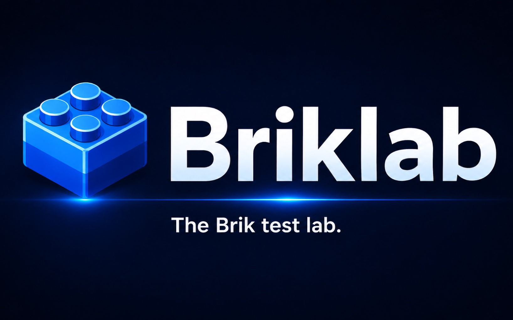

<p align="center">
  
</p>

Local Docker infrastructure for testing [Brik](https://github.com/getbrik/brik) pipelines end-to-end: write `brik.yml`, push to GitLab or Gitea, watch the pipeline run on real CI platforms.

## What is Briklab

Brik needs real CI/CD platforms to validate its shared libraries and runtime. Briklab provides that infrastructure locally via Docker Compose -- no cloud accounts, no shared servers.

- One command to set up everything (`init`)
- GitLab CE + Runner + Registry for GitLab CI pipelines
- Gitea + Jenkins for Jenkins pipelines
- Nexus 3 CE for artifact publishing (npm, Maven, PyPI, NuGet, Docker, raw)
- SSH target container for deploy E2E testing
- E2E pipeline testing with 24 automated scenarios on each platform
- Managed by a Bash CLI (`scripts/briklab.sh`)

For internal architecture details, see [docs/architecture.md](docs/architecture.md).

## Quick Start

### Prerequisites

- [Docker Desktop](https://www.docker.com/products/docker-desktop/) (18 GB RAM recommended)
- `jq` (`brew install jq`)

#### K8s / Deploy E2E (optional)

Required only for deploy E2E scenarios involving Kubernetes and ArgoCD (`node-deploy-k8s`, `node-deploy-gitops`, `node-deploy-rollback`, `node-deploy-failure`).

**k3d** (lightweight K3s in Docker):

| OS | Command |
|----|---------|
| macOS | `brew install k3d` |
| Linux | `wget -q -O - https://raw.githubusercontent.com/k3d-io/k3d/main/install.sh \| bash` |

**argocd CLI**:

| OS | Command |
|----|---------|
| macOS | `brew install argocd` |
| Linux | `curl -sSL -o argocd-linux-amd64 https://github.com/argoproj/argo-cd/releases/latest/download/argocd-linux-amd64 && sudo install -m 555 argocd-linux-amd64 /usr/local/bin/argocd && rm argocd-linux-amd64` |

See [k3d install docs](https://k3d.io/#installation) and [ArgoCD CLI install docs](https://argo-cd.readthedocs.io/en/stable/cli_installation/) for other methods.

### Network configuration

Add to `/etc/hosts`:

```
127.0.0.1  gitlab.briklab.test registry.briklab.test
127.0.0.1  gitea.briklab.test jenkins.briklab.test
127.0.0.1  argocd.briklab.test ssh-target.briklab.test
127.0.0.1  nexus.briklab.test
```

Add to Docker Desktop (Settings > Docker Engine):

```json
{
  "insecure-registries": [
    "registry.briklab.test:5050",
    "nexus.briklab.test:8082"
  ]
}
```

### Initialize

```bash
./scripts/briklab.sh init
```

> GitLab takes 3-5 minutes on first start. Jenkins builds a custom Docker image on first start. Nexus takes 2-3 minutes. The script waits automatically.

## Services

| Service | Port(s) | Credentials |
|---------|---------|-------------|
| GitLab CE | 8929 (HTTP), 2222 (SSH) | `root` / `Brik-Gtlb-2026` |
| GitLab Runner | - | - |
| Docker Registry | 5050 | - |
| Gitea | 3000 (HTTP), 222 (SSH) | `brik` / `Brik-Gitea-2026` |
| Jenkins | 9090 (HTTP), 50000 (agent) | `admin` / `Brik-Jenkins-2026` |
| Nexus 3 CE | 8081 (UI/API), 8082 (Docker) | `admin` / `Brik-Nexus-2026` |
| SSH Target | 22 (internal) | `deploy` / SSH key |
| k3d (k3s) | 6443, 8080 | - |
| ArgoCD | 9080 | `admin` / (dynamic, see `k3d-start` output) |

> **macOS note:** the registry uses port 5050 because AirPlay Receiver occupies port 5000.

Default credentials are defined in `.env`. Modify them **before** the first `init`.

### Access URLs

| Service | URL |
|---------|-----|
| GitLab UI | http://gitlab.briklab.test:8929 |
| GitLab SSH | `ssh://git@gitlab.briklab.test:2222` |
| Docker Registry | http://registry.briklab.test:5050/v2/_catalog |
| Gitea UI | http://gitea.briklab.test:3000 |
| Jenkins UI | http://jenkins.briklab.test:9090 |
| Nexus UI | http://nexus.briklab.test:8081 |
| Nexus Docker | http://nexus.briklab.test:8082 |
| ArgoCD UI | https://argocd.briklab.test:9080 |
| SSH Target | `ssh deploy@ssh-target.briklab.test` (internal only) |

### Nexus Repositories

Setup creates 6 hosted repositories for artifact publishing:

| Repository | Format | Endpoint | Usage |
|-----------|--------|----------|-------|
| `brik-npm` | npm | `:8081/repository/brik-npm/` | `npm publish` |
| `brik-maven` | maven2 (release) | `:8081/repository/brik-maven/` | `mvn deploy` |
| `brik-pypi` | pypi | `:8081/repository/brik-pypi/` | `twine upload` / `uv publish` |
| `brik-nuget` | nuget (V3) | `:8081/repository/brik-nuget/` | `dotnet nuget push` |
| `brik-docker` | docker | `:8082/v2/` | `docker push` |
| `brik-raw` | raw | `:8081/repository/brik-raw/` | Generic artifacts (Cargo workaround) |

> **Note:** Nexus CE does not support the Cargo registry protocol natively. Rust crate publishing uses `cargo publish --dry-run` for validation, with Docker as the actual publish target.

## CLI Commands

### Lifecycle

| Command | Description |
|---------|-------------|
| `briklab.sh init` | First launch (start + setup + smoke-test) |
| `briklab.sh start` | Start all containers (+ set root password) |
| `briklab.sh stop` | Stop all containers |
| `briklab.sh restart` | Stop + start |
| `briklab.sh clean` | Delete all data and volumes (irreversible) |

### Configuration

| Command | Description |
|---------|-------------|
| `briklab.sh setup` | Re-run GitLab/Runner/Gitea/Jenkins/Nexus configuration |
| `briklab.sh smoke-test` | Verify that each component is reachable |

### Testing

Platform is required: `--gitlab` or `--jenkins`. All other flags are identical.

| Command | Description |
|---------|-------------|
| `briklab.sh test --gitlab` | Run `node-minimal` on GitLab |
| `briklab.sh test --gitlab --all` | Run the full GitLab E2E suite |
| `briklab.sh test --gitlab --complete` | Run only `*-complete` scenarios (with Nexus publish) |
| `briklab.sh test --gitlab --project <name>` | Run a single GitLab scenario by name |
| `briklab.sh test --gitlab --list` | List available GitLab scenarios |
| `briklab.sh test --jenkins` | Run `node-minimal` on Jenkins |
| `briklab.sh test --jenkins --all` | Run the full Jenkins E2E suite |
| `briklab.sh test --jenkins --complete` | Run only Jenkins `*-complete` scenarios |
| `briklab.sh test --jenkins --project <name>` | Run a single Jenkins scenario by name |
| `briklab.sh test --jenkins --list` | List available Jenkins scenarios |

### Monitoring

| Command | Description |
|---------|-------------|
| `briklab.sh status` | Show container health and access URLs |
| `briklab.sh logs <service>` | Tail logs (gitlab, runner, registry, gitea, jenkins, nexus) |

### Kubernetes

| Command | Description |
|---------|-------------|
| `briklab.sh k3d-start` | Create k3d cluster + install ArgoCD |
| `briklab.sh k3d-stop` | Destroy the k3d cluster |

## Typical Workflow

```bash
# Day 1 - Full setup
./scripts/briklab.sh init                    # First time setup (~5 min)
./scripts/briklab.sh test --gitlab --all     # Run GitLab E2E suite
./scripts/briklab.sh test --jenkins --all    # Run Jenkins E2E suite
./scripts/briklab.sh stop                    # Done for the day

# Day N
./scripts/briklab.sh start                   # Restart (fast, data preserved)
./scripts/briklab.sh test --gitlab           # Quick GitLab smoke test
./scripts/briklab.sh test --jenkins          # Quick Jenkins smoke test
./scripts/briklab.sh stop                    # Done
```

## E2E Testing

### GitLab

Each GitLab E2E scenario pushes a test project to briklab GitLab, triggers a pipeline, and validates that specific jobs pass.

#### Scenarios (24 total)

##### Minimal stack coverage

| Scenario | Stack | Trigger | Validated stages | Expected |
|----------|-------|---------|-----------------|----------|
| `node-minimal` | Node.js | push `main` | init, build, test, deploy, notify | pass |
| `python-minimal` | Python | push `main` | init, build, test, deploy, notify | pass |
| `java-minimal` | Java | push `main` | init, build, test, deploy, notify | pass |
| `rust-minimal` | Rust | push `main` | init, build, test, deploy, notify | pass |
| `dotnet-minimal` | .NET | push `main` | init, build, test, deploy, notify | pass |

##### Full pipelines

| Scenario | Stack | Trigger | Validated stages | Expected |
|----------|-------|---------|-----------------|----------|
| `node-full` | Node.js | tag `v0.1.0` | init, release, build, quality, test, package, deploy, notify | pass |
| `python-full` | Python | tag `v0.1.0` | init, release, build, quality, security, test, package, deploy, notify | pass |
| `java-full` | Java | tag `v0.1.0` | init, release, build, quality, test, package, deploy, notify | pass |

##### Complete pipelines with Nexus publish

| Scenario | Stack | Trigger | Validated stages | Expected |
|----------|-------|---------|-----------------|----------|
| `node-complete` | Node.js | tag `v0.1.0` | init, release, build, test, package, notify | pass |
| `python-complete` | Python | tag `v0.1.0` | init, release, build, test, package, notify | pass |
| `java-complete` | Java | tag `v0.1.0` | init, release, build, test, package, notify | pass |
| `rust-complete` | Rust | tag `v0.1.0` | init, release, build, test, package, notify | pass |
| `dotnet-complete` | .NET | tag `v0.1.0` | init, release, build, test, package, notify | pass |

##### Security and Deploy

| Scenario | Stack | Trigger | Validated stages | Expected |
|----------|-------|---------|-----------------|----------|
| `node-security` | Node.js | push `main` | init, build, security, test, notify | pass |
| `node-deploy` | Node.js | tag `v0.1.0` | init, release, build, test, package, deploy, notify | pass |
| `node-deploy-dryrun` | Node.js | tag `v0.1.0` | init, release, build, test, package, deploy, notify | pass |
| `node-deploy-k8s` | Node.js | tag `v0.1.0` | init, release, build, test, package, deploy, notify | pass |
| `node-deploy-ssh` | Node.js | tag `v0.1.0` | init, release, build, test, package, deploy, notify | pass |
| `node-deploy-gitops` | Node.js | tag `v0.1.0` | init, release, build, test, package, deploy, notify | pass |
| `node-deploy-rollback` | Node.js | tag `v0.1.0` | init, release, build, test, package, deploy, notify | pass |

> `node-deploy-dryrun` reuses the `node-deploy` project with `BRIK_DRY_RUN=true`. `node-deploy-rollback` reuses `node-deploy-gitops` with `BRIK_DEPLOY_ROLLBACK_TEST=true`. CI variables are passed via the E2E framework.

##### Deploy failure scenario

| Scenario | Stack | Trigger | Expected failure | Expected |
|----------|-------|---------|-----------------|----------|
| `node-deploy-failure` | Node.js | tag `v0.1.0` | brik-deploy job fails (non-existent namespace) | fail |

##### Error scenarios

| Scenario | Stack | Trigger | Expected failure | Expected |
|----------|-------|---------|-----------------|----------|
| `error-build` | Node.js | push `main` | brik-build job fails | fail |
| `error-test` | Node.js | push `main` | brik-test job fails | fail |
| `error-config` | Node.js | push `main` | brik-init job fails (invalid brik.yml) | fail |

### Jenkins

Jenkins E2E testing mirrors the GitLab scenarios: pushes the Brik shared library and test projects to Gitea, then triggers Jenkins pipelines via the REST API.

The Jenkins pipeline runs the full Brik fixed flow:

```
Init -> Release -> Build -> Quality & Security -> Test -> Package -> Deploy -> Notify
```

#### Scenarios (24 total)

Jenkins runs the same 24 scenarios as GitLab (minimal, full, complete, security, deploy, error). The E2E framework supports CI variable injection via `buildWithParameters`.

```bash
# Run the default Jenkins E2E pipeline (node-minimal)
./scripts/briklab.sh test --jenkins

# Run the full Jenkins E2E suite
./scripts/briklab.sh test --jenkins --all

# Run a specific scenario
./scripts/briklab.sh test --jenkins --project node-deploy-k8s

# List available scenarios
./scripts/briklab.sh test --jenkins --list
```

### Test projects

Test project fixtures live in `test-projects/`. Each has a `brik.yml` and platform-specific CI config (`.gitlab-ci.yml` for GitLab, `Jenkinsfile` for Jenkins).

| Project | Stack | Runner Image | Purpose |
|---------|-------|--------------|---------|
| `node-minimal` | Node.js | `brik-runner-node:22` | Basic flow (init, build, test) |
| `node-full` | Node.js | `brik-runner-node:22` | All stages (release, quality, package) |
| `node-security` | Node.js | `brik-runner-node:22` | Security stage (npm audit) |
| `node-deploy` | Node.js | `brik-runner-node:22` | Deploy stage validation (compose target) |
| `node-deploy-k8s` | Node.js | `brik-runner-node:22` | Deploy to Kubernetes (k8s target) |
| `node-deploy-ssh` | Node.js | `brik-runner-node:22` | Deploy via SSH (ssh target) |
| `node-deploy-gitops` | Node.js | `brik-runner-node:22` | Deploy via GitOps + ArgoCD (gitops target) |
| `node-deploy-failure` | Node.js | `brik-runner-node:22` | Intentional deploy failure (non-existent namespace) |
| `python-minimal` | Python | `brik-runner-python:3.13` | Python stack (pytest) |
| `python-full` | Python | `brik-runner-python:3.13` | Full Python pipeline (ruff, pip-audit, Docker) |
| `java-minimal` | Java | `brik-runner-java:21` | Java stack (JUnit 5) |
| `java-full` | Java | `brik-runner-java:21` | Full Java pipeline (checkstyle, Docker) |
| `rust-minimal` | Rust | `brik-runner-rust:1` | Rust stack (cargo test) |
| `dotnet-minimal` | .NET | `brik-runner-dotnet:9.0` | .NET stack (xUnit) |
| `node-complete` | Node.js | `brik-runner-node:22` | Full pipeline + npm/Docker publish to Nexus |
| `python-complete` | Python | `brik-runner-python:3.13` | Full pipeline + PyPI/Docker publish to Nexus |
| `java-complete` | Java | `brik-runner-java:21` | Full pipeline + Maven/Docker publish to Nexus |
| `rust-complete` | Rust | `brik-runner-rust:1` | Full pipeline + Cargo dry-run/Docker publish to Nexus |
| `dotnet-complete` | .NET | `brik-runner-dotnet:9.0` | Full pipeline + NuGet/Docker publish to Nexus |
| `node-error-build` | Node.js | `brik-runner-node:22` | Intentionally broken build |
| `node-error-test` | Node.js | `brik-runner-node:22` | Intentionally failing tests |
| `invalid-config` | Node.js | `brik-runner-base:latest` | Invalid brik.yml (version: 99) |

> Runner images are selected automatically by the init job based on `project.stack` and `project.stack_version` in `brik.yml`. The init job resolves the image and propagates it via dotenv to downstream jobs. Images are published at `ghcr.io/getbrik/brik-runner-<stack>:<version>`.

## Known Issues (E2E)

Full suite run on 2026-04-14

| Issue | Affected scenarios | Root cause |
|-------|-------------------|------------|
| Nexus registry auth | all `*-complete` (Package fail) | Runners lack `docker login` to Nexus Docker registry |
| Compose deploy auth | `node-deploy` (Deploy fail) | Runner Docker daemon not authenticated to GitLab registry for `docker compose pull` |
| SSH host key | `node-deploy-ssh` (Deploy fail) | SSH target host key not in runner's `known_hosts` |
| Node lint config | `node-complete` (Verify fail) | eslint configuration issue in test project |
| Rollback design | `node-deploy-rollback` | Known design issue (see `deploy-remaining-issues.md`) |
| Runner saturation | `node-minimal`, `python-minimal` (GitLab timeout) | Single runner overwhelmed by 24 concurrent pipelines |

## Troubleshooting

**GitLab won't start** -- Check Docker Desktop has at least 18 GB RAM allocated. First start takes 3-5 minutes. Check logs: `./scripts/briklab.sh logs gitlab`

**Runner errors (`runner_system_failure` / `image_pull_failure`)** -- Verify `helper_image` is present in the runner's `config.toml`. Check logs: `./scripts/briklab.sh logs runner`. If needed, re-run `./scripts/briklab.sh setup`.

**Port 5000 already in use (macOS)** -- AirPlay Receiver occupies port 5000. Briklab uses 5050 by default. To free 5000: Settings > General > AirDrop & Handoff > AirPlay Receiver, uncheck.

**Registry unreachable** -- Verify `"insecure-registries": ["registry.briklab.test:5050"]` in Docker Desktop settings. Test: `curl http://registry.briklab.test:5050/v2/`

**Jenkins CasC errors** -- Check `./scripts/briklab.sh logs jenkins` for Configuration-as-Code errors. Common issue: plugin not installed. Verify `images/jenkins/plugins.txt` includes all required plugins. To reload CasC without restarting Jenkins, use the `jenkins_reload_casc` helper in `briklab.sh` (only works for CasC YAML changes; env var changes require a full restart).

**Jenkins pipeline can't find Brik library** -- The Brik shared library must be pushed to Gitea before triggering a pipeline. Run `./scripts/briklab.sh setup` to ensure Gitea is configured, then push repos with the E2E test command.

**Gitea shows install page** -- On first start, Gitea requires initial installation. The setup script handles this automatically. If it fails, check logs: `./scripts/briklab.sh logs gitea`

**Nexus slow to start** -- First start takes 2-3 minutes (JVM + plugin initialization). The healthcheck has a 180s start_period. Check logs: `./scripts/briklab.sh logs nexus`

**Nexus Docker push fails (HTTP)** -- Add `"nexus.briklab.test:8082"` to `insecure-registries` in Docker Desktop settings. The Nexus Docker registry uses HTTP, not HTTPS.

**Nexus repository creation fails** -- If `setup` is run before Nexus is fully ready, repository creation may fail. Wait for the healthcheck to pass, then re-run: `./scripts/briklab.sh setup`

For the complete list of known issues and solutions, see [docs/architecture.md - Known Gotchas](docs/architecture.md#known-gotchas).

## Cleanup

```bash
# Stop containers (data preserved)
./scripts/briklab.sh stop

# Delete all data and volumes (irreversible, requires confirmation)
./scripts/briklab.sh clean

# Full removal: after clean, remove Docker images manually
docker rmi gitlab/gitlab-ce:18.10.1-ce.0 gitlab/gitlab-runner:alpine3.21-bleeding registry:3.0
docker rmi gitea/gitea:1.25.5
docker rmi briklab-jenkins  # custom-built Jenkins image
docker rmi sonatype/nexus3:3.90.2-alpine
docker network rm brik-net 2>/dev/null
```

## Script Architecture

Briklab scripts are organized into reusable libraries under `scripts/lib/`:

```
scripts/
  briklab.sh                    # CLI entry point
  lib/
    common.sh                   # Shared utilities (logging, retry, env loading)
    verify.sh                   # Environment verification
    auth/
      gitlab-pat.sh             # GitLab PAT management
      gitea-pat.sh              # Gitea PAT management
      argocd-token.sh           # ArgoCD token retrieval
      argocd-portfwd.sh         # ArgoCD port-forward management
    setup/
      gitlab.sh                 # GitLab CE configuration
      runner.sh                 # GitLab Runner registration
      gitea.sh                  # Gitea configuration
      jenkins.sh                # Jenkins CasC + Job DSL
      nexus.sh                  # Nexus repository creation
      k3d.sh                    # k3d cluster + ArgoCD install
      ssh-target.sh             # SSH target container setup
      smoke-test.sh             # Post-setup health checks
    e2e/
      preflight.sh              # Pre-flight checks before E2E runs
      push-test-project-gitlab.sh  # Push repos to GitLab
      push-test-project-gitea.sh   # Push repos to Gitea
      e2e-gitlab-suite.sh       # GitLab E2E scenario runner
      e2e-gitlab-test.sh        # GitLab single pipeline test
      e2e-jenkins-suite.sh      # Jenkins E2E scenario runner
      e2e-jenkins-test.sh       # Jenkins single pipeline test
```

Auth libraries are reusable -- each validates and caches credentials, and can be sourced from any script.

## Status

- [x] GitLab CE + Runner + Registry
- [x] Gitea + Jenkins (CasC + Job DSL)
- [x] Nexus 3 CE -- artifact publishing (npm, Maven, PyPI, NuGet, Docker, raw)
- [x] Automated init with smoke tests
- [x] E2E pipeline testing -- GitLab (24 scenarios: minimal, full, complete, security, deploy, error)
- [x] E2E pipeline testing -- Jenkins (24 scenarios, same coverage as GitLab)
- [x] Security stage E2E
- [x] Deploy stage E2E (k8s, ssh, compose, gitops, rollback, failure)
- [x] CI variable injection for E2E scenarios (dry-run, rollback tests)
- [x] SSH target container for deploy E2E
- [x] Error scenario E2E (build fail, test fail, invalid config, deploy fail)
- [x] k3d + ArgoCD integration (setup script, CLI commands, gitops E2E scenario)
- [x] Script refactoring into reusable libraries (auth, setup, e2e)
- [ ] Complete E2E scenarios with Nexus artifact verification
- [ ] Registry auth for runners (Nexus Docker push from *-complete scenarios)
- [ ] SSH host key provisioning for deploy-ssh scenarios

## Related

- [Brik](https://github.com/getbrik/brik) -- the portable CI/CD pipeline system
- [Architecture](docs/architecture.md) -- how Briklab works internally

## License

MIT
